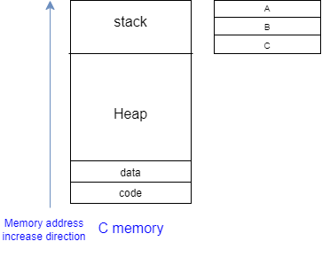

### How to make array with out 'new'?
- In C#, the new keyword is used
    - The variable from new keyword is reference type
    - So can not copy the array
    - Array and Object

### In C, Array can make a value type as well
- In fact, all variables can make both value type and reference type
- Let's how value type works inside

### Stack memory
- It is different from data structure 'stack'
    - just same method LIFO
- `The temporary storage space used for local variables and other data in each function is called the 'stack memory'`
- The size of the stack memory is determined at build time
- The location of the stack memory is determined at runtime
- First time, Data is saved at code, data section
- Local variables are saved at stack(when function is called we need to know local variable information)
- LIFO

### Primitive data type variables occupy stack memory
- Every time a function is called, the space required for that function is allocated from the stack, and when the function returns, the space is simply discarded
    - The memory is not actually erased
- The reason why all primitive data type variables (char, int, float) could be used without new is that they are allocated on the stack
- When a primitive data type is passed as a function parameter, a copy is made on the stack
—> this is known as a value type
- Stack memory is always tightly packed without gaps when borrowed and returned
- Data created with new is allocated in the heap memory
    - In this case, the memory may have gaps or fragmentation
- When passing parameters, the values are copied to the stack
- The stack is generally faster than the heap