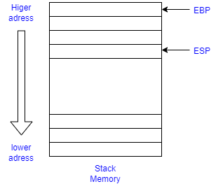

### simple functinon call and stack memory
```c
int add(const int a, const int b)
{
    int res = a + b;
    return res;
}

int main(void)
{
    int a = 1;
    int b = 2;
    return add(a, b);
}
```


### let's see about stack memory
- The stack stacks from higher addresses to lower addresses
- ESP(Extended Stack Pointer)
    - current stack pointer
- EBP(Extended Base pointer)
    - current stack frame general first address
- stack frame
    - stack memory range using each function 

