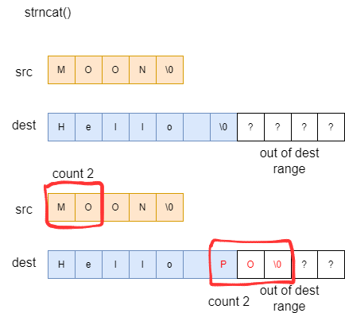

### string concatenation1: starcat()
`char* strcat(char* dest, const char* src);`
- It is int <string.h>
- A function that appends the string from src to the end of dest
    - It adds the string from src starting from the position of the null character in dest
    - In other words, the null character in dest is replaced with src[0]
```c
const char* src = "MOON";
chat dest[11] = "Hello ";

strcat(dest, src);
```

- **dest** must have enough space
    - If this length is exceeded, undefined behavior occurs

```c
const char* src = "MOON";
chat dest[7] = "Hello ";

strcat(dest, src);
```


### string concatenation1: star**n**cat()
`char* strncat(char* dest, const char* src, size_t count);`
- After copying count characters, a null character is added at the end
- Therefore, up to **count + 1** characters are overwritten
```c
const char* src = "MOON"
char dest[11] = "Hello ";

strncat(dest, src, 2);
```

- If written beyond the length of `dest`, **undefined behavior** also occurs
    - However, with count, the programmer can control to prevent this case
    - Therefore, it is somewhat safer than strcat()

    
