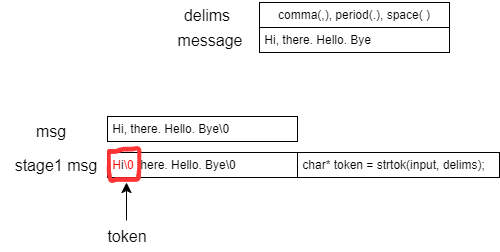
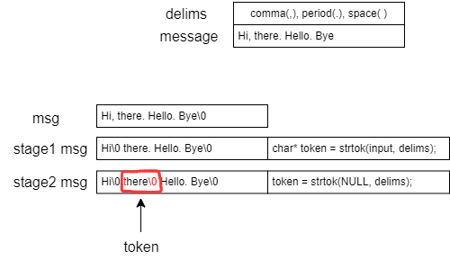
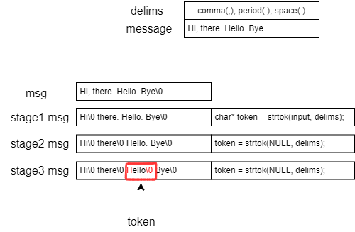
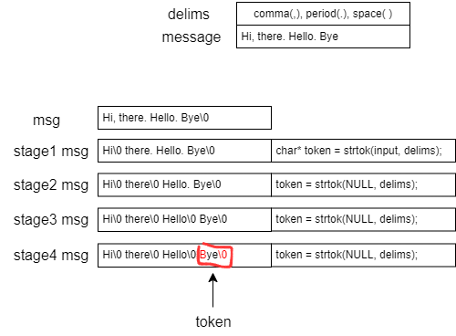
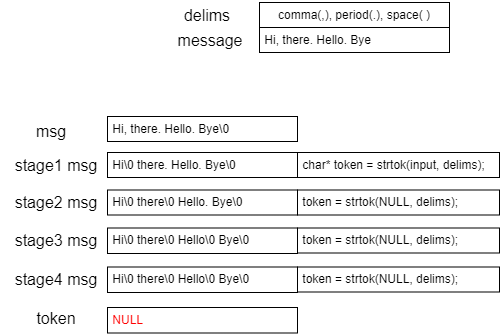

### String tokenization







### Summary
```c
char msg[] = "Hi, there. Hello. Bye";
const char[] delims[] = ",. ";

char* token = strtok(msg, delims);
while (token != NULL) {
    printf("%s\n", token);
    token = strtok(NULL, delims);
}
```
- To start tokenizing, pass the string(msg) to strtok()
- To get the next token from the message, pass NULL instead
- If there are no more tokens, strtok() returns NULL


### Two things to realize here:

1. The string being tokenized is not const! The original string is modified
2. Since strtok() uses the previously passed message when NULL is given as an argument, the message must be stored somewhere
    - Where could it be?
    - A static variable inside the function seems most appropriate
- A static variable inside the function doesn’t disappear when the function ends
- It’s likely stored in something like the data section and holds the address
- It moves with the pointer
`char* strtok(char* str, const char* delims);`
- In C11, there is a safer version of the function
    - strtok_**s**()

### Characteristics of C string functions:
- Quite a few functions do not modify the string at all!
    `const char*`
- Even if they modify the string, they try not to alter the original.
    - They only modify a copy
    - Exception: strtok()
        - There's no other way
        - If you want to preserve the original string, you need to create a copy before calling strtok()
- It never creates a new string (i.e., a contiguous block of char memory)!