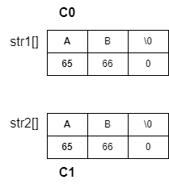

### algorithm
```c
const char* str = "AB";
const char* str2 = "AC";
int result = compare_string(str1, str2);
```

1. Read one character at a time from each string
2. Compare the two characters
    a) If c0 is smaller than c1, return a negative value
    b) If c0 is greater than c1, return a positive value
    c) If c0 and c1 are equal and both are null characters, return 0
3. Move to the next character and go back to step 1
