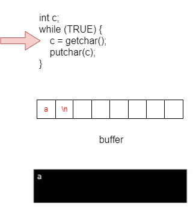

### Algorithm for reading one character at a time - trial 1
1. Read a character
2. Use that character where needed.
3. Go back to step 1

### Code for reading one character at a time
```c
#include <stdio.h>

int c;

while (TRUE) {
    c = getchar(); /* #define TRUE(1) */
    putchar(c);
}
```

### Code for reading one character at a time
1. `getchar()` function is still waiting (not yet returned)
2. Type 'a' on the keyboard and press Enter
<br />

<br />


### Code for reading one character at a time
1. `getchar()` function is still waiting (not yet returned)
2. Type 'a' on the keyboard and press Enter
3. Read a character from the buffer\
\


### Code for reading one character at a time
1. `getchar()` function is still waiting (not yet returned)
2. Type 'a' on the keyboard and press Enter
3. Read a character from the buffer
4. Print the read character\
\

### Code for reading one character at a time
1. `getchar()` function is still waiting (not yet returned)
2. Type 'a' on the keyboard and press Enter
3. Read a character from the buffer
4. Print the read character
5. If there are still characters in the buffer, go back to step 3\
\

  

### Code for reading one character at a time
1. `getchar()` function is still waiting (not yet returned)
2. Type 'a' on the keyboard and press Enter
3. Read a character from the buffer
4. Print the read character
5. If there are no more characters in the buffer, go back to step 1\ 
\


  
### getChar() Half-baked explanation
```c
int getchar(void);
int fgetc(FILE* steram);
```
- Reads a character from the keyboard (stdio) and returns it as an `int`
- Equivalent to `fgetc(stdin)`


